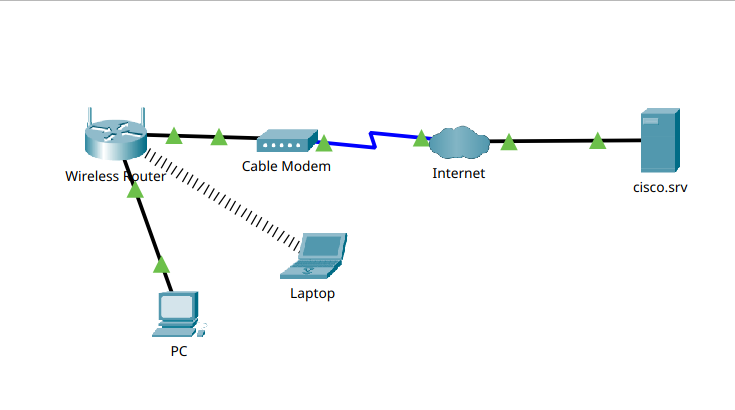

# Creación de una red simple en Packet Tracer
## Objetivo
Construir una red simple y configurar los dispositivos de red para lograr conectarlos a internet y al proveedor de servicios de internet (ISP)
## Topología
- 1 PC
- 1 Laptop
- 1 Servidor (ISP)
- 1 Router inalámbrico
- 1 Cable Módem (Dispositivo de hardware)

## Conceptos fundamentales
- Configuración básica de redes en dispositivos de punto final (Endpoint Devices)
- Asignación dinámica de IP's mediante protocolo DHCP (Dynamic Host Configuration Protocol)
- Máscara de subred y Puerta de enlace predeterminada
## Pasos de la actividad
1. Agregar dispositivos de punto final, cable módem y router.
2. Conectar dispositivos mediante cable ethernet (PC) y conexión inalambrica (Laptop)
3. Configurar aspectos de red para asignación dinámica de IP's (DHCP)
4. Concluir hallando la dirección IPv4, la máscara de subred y la puerta de enlace predeterminada de los dispositivos de punto final conectados a internet
## Conclusión
| Dispositivo | Dirección IPv4 | Máscara de Subred | Puerta de enlace predeterminada |
|-------------|----------------|-------------------|---------------------------------|
|PC           |192.168.0.2     |255.255.255.0      |192.168.0.1                      |
|Laptop       |192.168.0.3     |255.255.255.0      |192.168.0.1                      |
